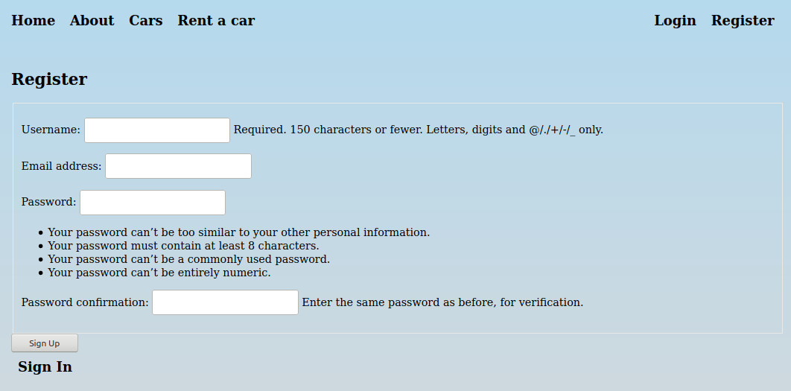
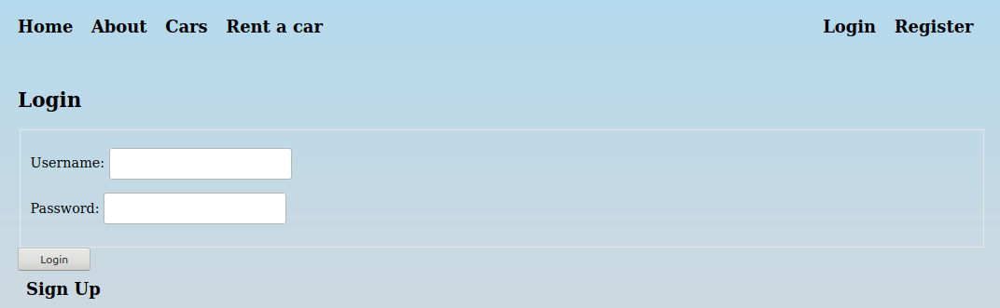
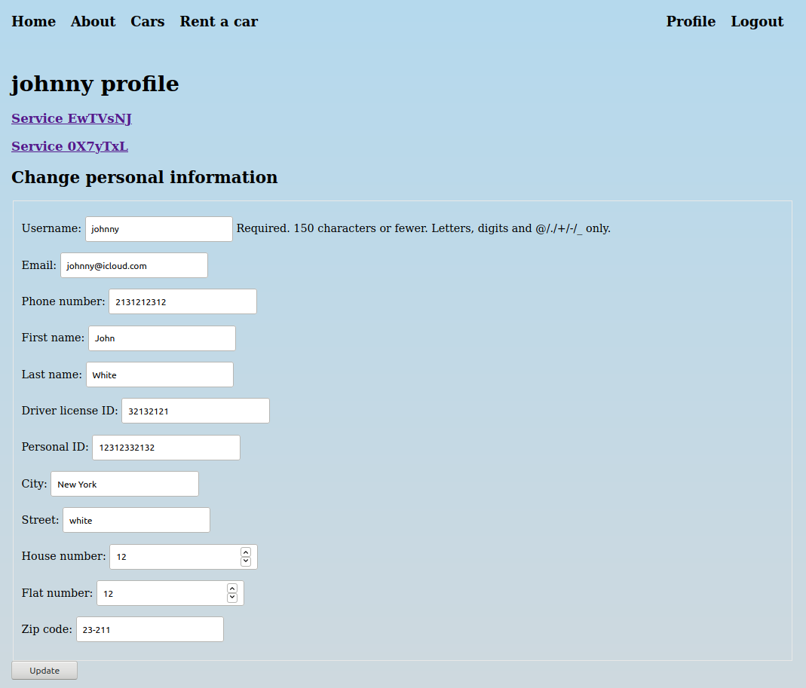
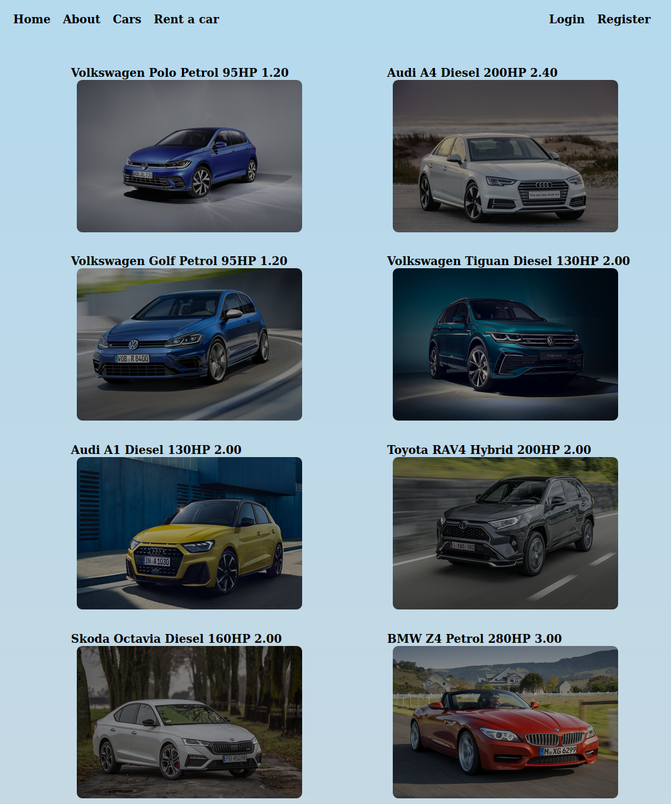
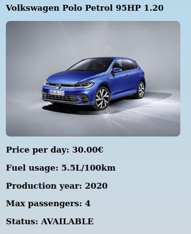
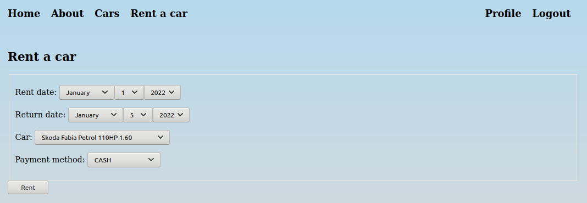
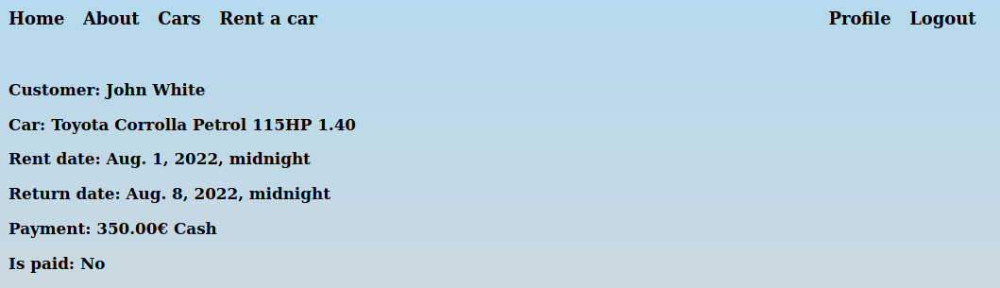

# car-rent-backend

## Run app

For the first use, copy `.env.template` to `.env` file and set your own `SECRET_KEY`

```shell
cp .env.template .env
```

```shell
docker-compose up
```

## Stop app

```shell
^C
```

```shell
docker-compose down
```


## Technology stack

- Backend: Django
- Frontend: Django Forms
- Database: PostgreSQL
- Containers: Docker

## Usage

The application is a prototype of a service that allows to book cars from a rental company. The user is able to browse available vehicles along with detailed data such as rental price, fuel consumption, allowed number of passengers, etc. To register a new account, user has to fill out the form below.

<p align="center">

</p>

After successfully setting up the account, the user is redirected to the login page.

<p align="center">

</p>

Profile page is visible after successful login. It contains the user's personal information and services.

<p align="center">

</p>

Available cars can be viewed in the catalog, shown below.

<p align="center">

</p>

Double click on the selected car to see its detailed information.

<p align="center">

</p>

A page with rent form is available from navbar. After selecting the car, payment method, pick-up and return date, the booking is confirmed.

<p align="center">

</p>

The information about booked service is accessible from user's profile.

<p align="center">

</p>
